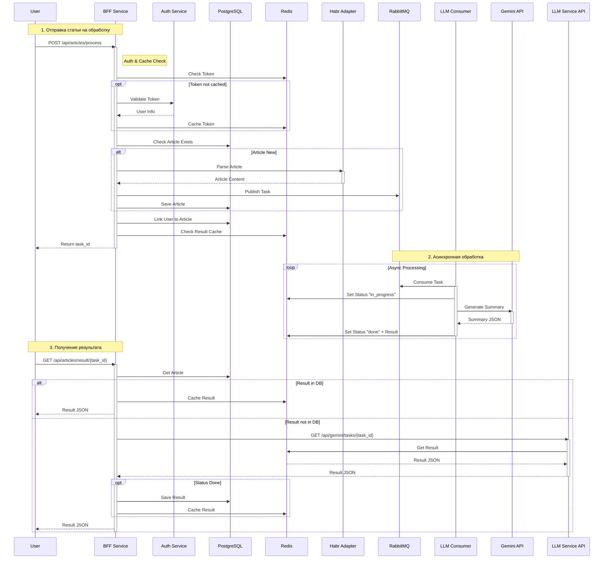
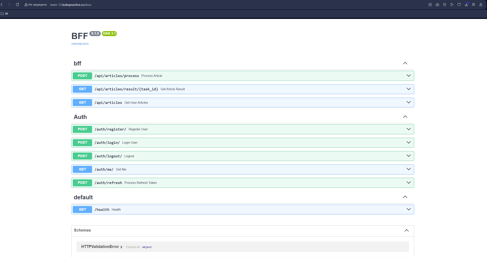
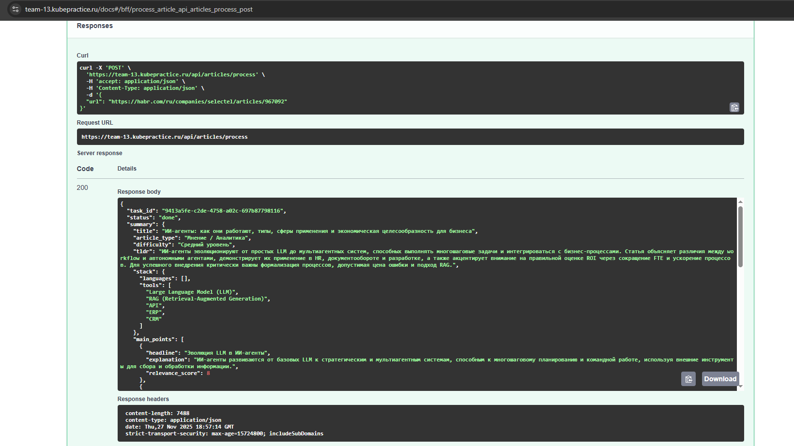
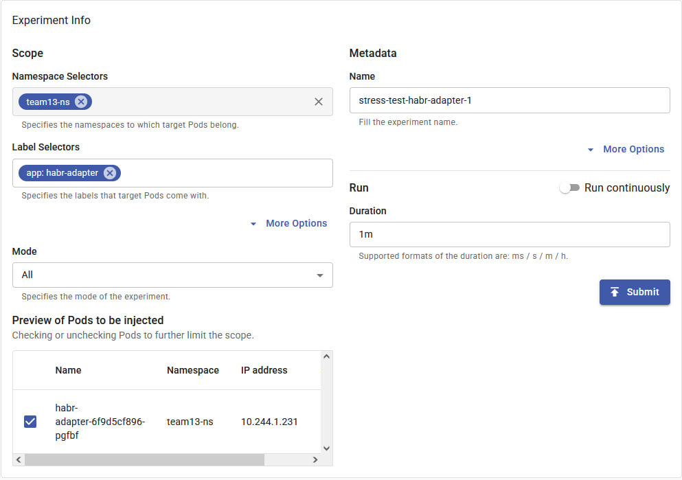
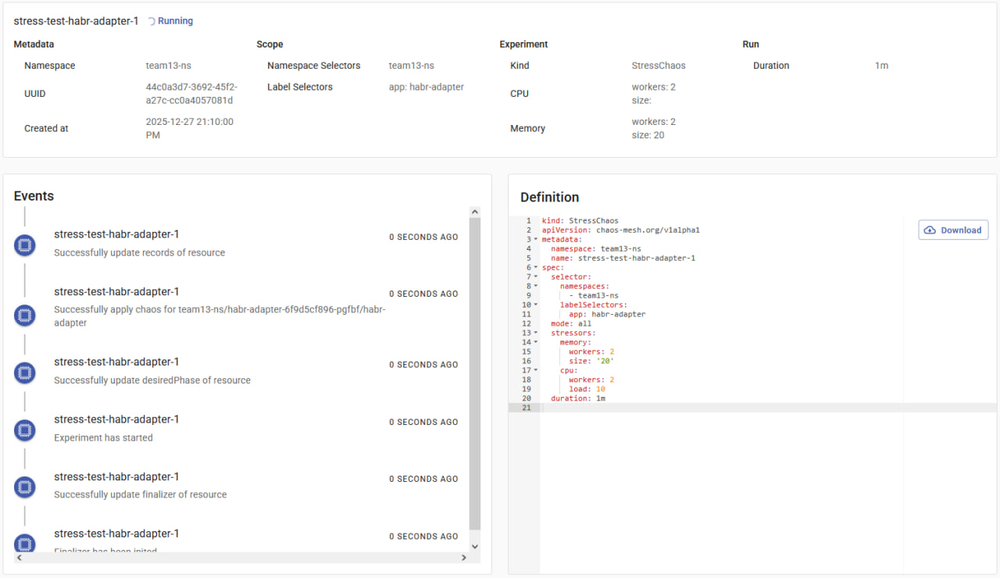
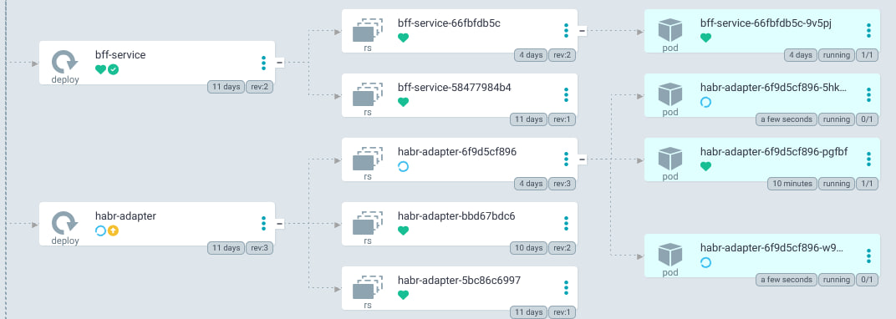
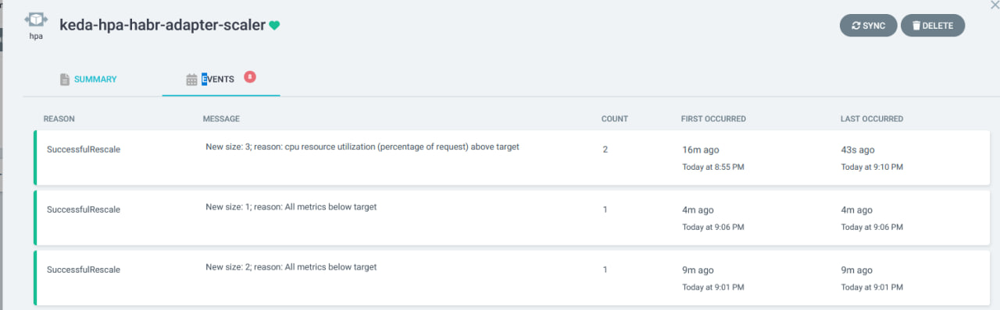

# HabrParserAI

Микросервисная архитектура для парсинга статей с Habr и их обработки с помощью LLM

## Основные возможности

- **BFF Service** - Backend for Frontend, точка входа для клиентов
- **Auth Service** - Сервис аутентификации и авторизации пользователей
- **Habr Adapter** - Сервис для парсинга и получения контента статей
- **LLM Service** - Сервис интеграции с LLM (Gemini) для анализа текста
- **Async Processing** - Асинхронная обработка задач через RabbitMQ
- **Infrastructure** - Полный стек с PostgreSQL, Redis и RabbitMQ в Docker

## Установка и запуск

1. Создать файл `.env` на основе `.env.example`:
```bash
cp .env.example .env
```

2. Запустить проект через Docker Compose:
```bash
docker-compose up -d --build
```

Сервисы будут доступны по адресам:
- BFF Service: http://localhost:8000
- Auth Service: http://localhost:5002
- Habr Adapter: http://localhost:5000
- LLM Service: http://localhost:5001
- RabbitMQ UI: http://localhost:15672 (user/password)

## Структура проекта

```
bff/                # Backend for Frontend сервис
auth_service/       # Сервис аутентификации
habr_adapter/       # Сервис парсинга Habr
llm_service/        # Сервис работы с LLM
docker-compose.yaml # Оркестрация контейнеров
logs/               # Логи приложений
```

## Схема взаимодействия сервисов



## Пример использования

### 1. Регистрация пользователя

```bash
curl -X 'POST' \
  'http://localhost:8000/auth/register/' \
  -H 'accept: application/json' \
  -H 'Content-Type: application/json' \
  -d '{
  "phone_number": "79991234567",
  "password": "strongpassword123",
  "first_name": "Ivan",
  "last_name": "Ivanov"
}'
```

### 2. Авторизация (получение cookie)

```bash
curl -X 'POST' \
  'http://localhost:8000/auth/login/' \
  -H 'accept: application/json' \
  -H 'Content-Type: application/json' \
  -d '{
  "phone_number": "79991234567",
  "password": "strongpassword123"
}' \
  -c cookies.txt
```

### 3. Отправка статьи на обработку

```bash
curl -X 'POST' \
  'http://localhost:8000/api/articles/process' \
  -H 'accept: application/json' \
  -H 'Content-Type: application/json' \
  -b cookies.txt \
  -d '{
  "url": "https://habr.com/ru/companies/selectel/articles/967092"
}'
```

Response:
```json
{
  "task_id": "e79e4b7d-5465-4bc4-b568-fdcd584aecd7",
  "status": "queued"
}
```

### 4. Получение результата

```bash
curl -X 'GET' \
  'http://localhost:8000/api/articles/result/e79e4b7d-5465-4bc4-b568-fdcd584aecd7' \
  -H 'accept: application/json' \
  -b cookies.txt
```

Response:
```json
{
  "status": "done",
  "summary": {
    "title": "Как работают ИИ-агенты...",
    "tldr": "Статья объясняет...",
    ...
  }
}
```

## Заметки

Первый успешный деплой в k8s, оно живое



```
(base) PS Q:\PythonProjects\team13> helm upgrade team13-app ./k8s/helm/team13-app -n team13-ns -f ./k8s/helm/team13-app/values.yaml -f secrets.yaml --kubeconfig team13-kubeconfig.yaml
Release "team13-app" has been upgraded. Happy Helming!
NAME: team13-app
LAST DEPLOYED: Thu Nov 27 21:08:17 2025
NAMESPACE: team13-ns
STATUS: deployed
REVISION: 5
DESCRIPTION: Upgrade complete
TEST SUITE: None
(base) PS Q:\PythonProjects\team13> kubectl get ingress -n team13-ns --kubeconfig team13-kubeconfig.yaml
NAME                 CLASS   HOSTS                     ADDRESS   PORTS     AGE
team13-app-ingress   nginx   team-13.kubepractice.ru             80, 443   5s
(base) PS Q:\PythonProjects\team13> kubectl get pods -n team13-ns --kubeconfig team13-kubeconfig.yaml
NAME                            READY   STATUS    RESTARTS   AGE
auth-service-69d5dd6ffd-w975g   1/1     Running   0          14m
bff-service-6f9f97f89-lwh5c     1/1     Running   0          10m
habr-adapter-67c698fd7f-ksskz   1/1     Running   0          10m
llm-consumer-57876c547b-prctk   1/1     Running   0          14m
llm-service-ff968cc5-hf4r7      1/1     Running   0          10m
rabbitmq-5d58f9d868-tdjjk       1/1     Running   0          14m
redis-6d65768944-ph5jf          1/1     Running   0          14m
(base) PS Q:\PythonProjects\team13> kubectl top pods -n team13-ns --kubeconfig team13-kubeconfig.yaml
NAME                            CPU(cores)   MEMORY(bytes)   
auth-service-69d5dd6ffd-w975g   2m           89Mi
bff-service-6dffcc5cfb-zcbbc    2m           72Mi
habr-adapter-67c698fd7f-ksskz   2m           43Mi
llm-consumer-57876c547b-prctk   1m           36Mi
llm-service-ff968cc5-hf4r7      2m           45Mi
rabbitmq-5d58f9d868-tdjjk       3m           122Mi
redis-6d65768944-ph5jf          4m           3Mi
```

##  Chaos Engineering: CPU & Memory Stress Test
### Цель:
Проверить корректность работы механизма горизонтального autoscaling, управляемого KEDA, при резком росте нагрузки на микросервис habr-adapter по CPU и памяти.






### Результаты:
* В ответ на стресс-нагрузку KEDA успешно инициировала масштабирование: количество реплик выросло с 1 до 3.

* После завершения эксперимента (снижения нагрузки ниже пороговых значений) KEDA автоматически уменьшила количество реплик до 2 с логом:

```
SuccessfulRescale: New size: 2; reason: All metrics below target.
```

* Система осталась функционально доступной на протяжении всего эксперимента.